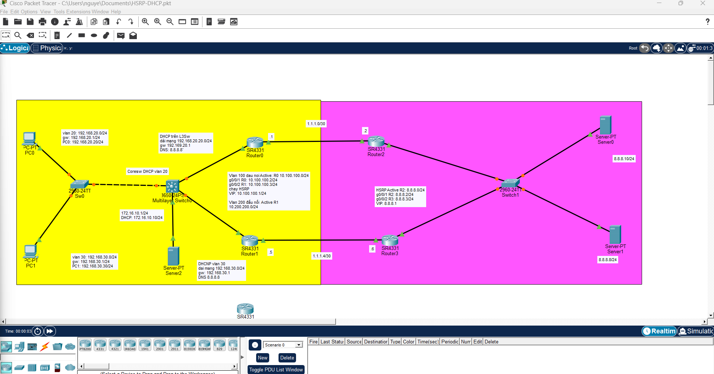

# CCNA Lab: Định tuyến tĩnh, VLAN, HSRP & DHCP

Đây là bài thực hành tổng hợp CCNA, bao gồm các cấu hình:
- **Định tuyến tĩnh (Static Routing)**
- **VLAN (Virtual Local Area Network)**
- **HSRP (Hot Standby Router Protocol)**
- **DHCP (Dynamic Host Configuration Protocol)**

## 📂 Danh sách các file trong Lab:
- 📄 **\De_bai_Thuc_hanh_Mang.docx\**: Đề bài chi tiết và yêu cầu cấu hình của bài thực hành.
- 💾 **\HSRP-DHCP.pkt\**: File bài tập thực hành thiết kế mạng trên phần mềm Cisco Packet Tracer.

## 🖼️ Sơ đồ mạng (Topology)

## 🚀 Hướng dẫn sử dụng:
1. Clone repository này về máy bằng lệnh: \git clone https://github.com/ducngocn/lab-ccna.git\
2. Cài đặt phần mềm **Cisco Packet Tracer**.
3. Đọc yêu cầu trong file Word (\.docx\).
4. Mở file \.pkt\ bằng Packet Tracer và tiến hành thiết lập cấu hình theo yêu cầu.
